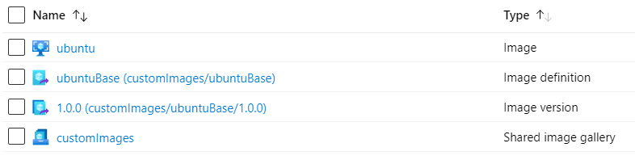

# Read Me

## Limitations

There is no support for Azure Key Vault except for certificates. (See <broken/std_key_vault.json>.)

## Instructions

1. Define some variables:

    ```bash
    rg=images
    loc=westeurope
    sig=customImages
    pub=AzureCitadel
    img=ubuntuBase
    ```

    > Customise these values as required.

1. Create a resource group

    ```bash
    az group create --name $rg --location $loc
    ```

1. Create the shared image gallery and definition (optional)

    > If you are only using the standard_image.json then you can skip this step

    ```bash
    az sig create --gallery-name $sig --resource-group $rg --location $loc
    sigId=$(az sig show --resource-group $rg --gallery-name $sig --query id --output tsv)
    az sig image-definition create --gallery-name $sig --gallery-image-definition $img --publisher $pub --offer Ubuntu --sku 18.04 --os-type linux --resource-group $rg --location $loc
    ```

    > See `az sig image-definition create --help` for more switch arguments such as min/max CPU and memory, or EOL dates.

1. Export the environment variables

    * ARM_TENANT_ID
    * ARM_SUBSCRIPTION_ID
    * ARM_CLIENT_ID
    * ARM_CLIENT_SECRET

    Or pull the values from a key vault or via CLI commands. The example below is based on the default values for the terraform-state-singletenant repo e.g.:

    ```bash
    kv=$(az keyvault list --resource-group terraform --query "[0].name" --output tsv)
    export ARM_TENANT_ID=$(az account show --query tenantId --output tsv)
    export ARM_SUBSCRIPTION_ID=$(az account show --query id --output tsv)
    export ARM_CLIENT_ID=$(az keyvault secret show --name client-id --vault-name $kv --query value --output tsv)
    export ARM_CLIENT_SECRET=$(az keyvault secret show --name client-secret --vault-name $kv --query value --output tsv)
    ```

1. Run the packer job

    ```bash
    packer build gallery_image.json
    ```

1. Check the Azure resource have been created correctly in the portal

    
