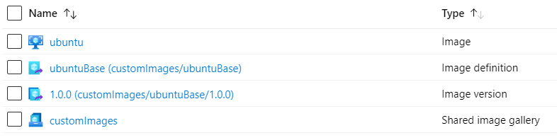

# Read Me

## Limitations

There is no support for Azure Key Vault except for certificates. (See <broken/std_key_vault.json>.)

## Variables

Define some variables:

```bash
rg=images
loc=westeurope
sig=customImages
pub=AzureCitadel
img=ubuntuBase
```

> Customise these values as required.

## Deploy the resources

The code block below will

1. Create a resource group
1. Create the shared image gallery:
1. Grab the shared imaged gallery's resource ID:
1. Create the shared image definition:

```bash
az group create --name $rg --location $loc
az sig create --gallery-name $sig --resource-group $rg --location $loc
sigId=$(az sig show --resource-group $rg --gallery-name $sig --query id --output tsv)
az sig image-definition create --gallery-name $sig --gallery-image-definition $img --publisher $pub --offer Ubuntu --sku 18.04 --os-type linux --resource-group $rg --location $loc
```

> See `az sig image-definition create --help` for more switch arguments such as min/max CPU and memory, or EOL dates.

## Run the Packer build

```bash
packer build gallery_image.json
```

## Azure Resources


